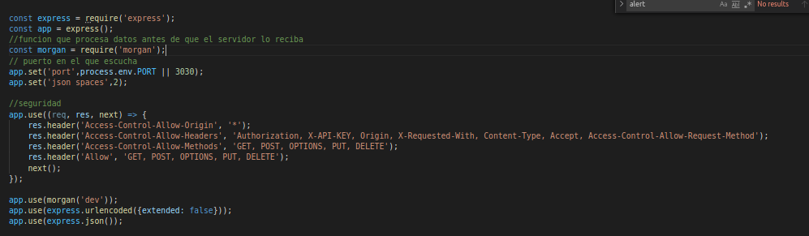
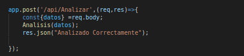
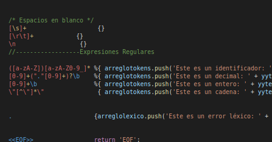
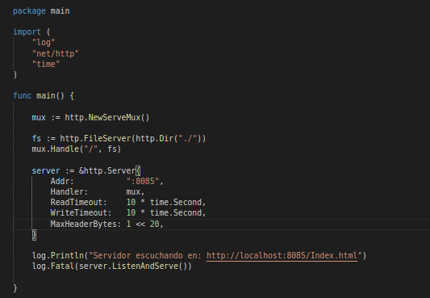
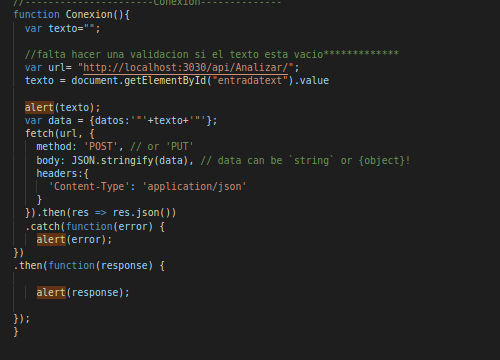

# Manual Tecnico  Horacio Ciraiz Orellana 201513758

# Descripcion:
- Aplicacion Web que realiza la traduccion de un lenguaje a otro utilizando herramientas para analisis léxico y sintactico, tecnologias Web Nodejs,desarrollado en lenguaje Go y JavaScript.


# Objetivos:

- Realizar una Aplicacion Web para traducir  lenguaje Java a JavaScript.
# Proyecto Translator in Docker

# Conexion
    -El proyecto Translator in Docker fue desarrollado con distintas tecnologias  y lenguajes
#Backend
    Desarrollado con tecnologia NodeJs,Express,Core,Morgan y Lenguaje de Programacion JavaScript se implementan conjunto a la herramienta Jison para la creacion de Analizadores Lexicos y Sintacticos 

# Nodejs
El servidor fue implementado con tecnologia nodejs,express y acontinuacion se describiran los elementos mas importantes de este:

```sh
$ npm install express --save
$ npm install morgan  --save
$ npm install jison
$ npm install cors -g
$ npm install --save-dev nodemon
$ node app
```

el siguiente codigo permite levantar el servidor Nodejs y configurar las distintas partes de este para recibir las peticiones
[](Imagenes/T1.png)

luego se configura el servidor con una serie de metodos POST para la recepcion de peticiones por parte de la aplicacion Web

[](Imagenes/T2.png)

y el metodo principal que hace el llamado al metodo que inicia el analisis del documento y la recepccion de erroes

[](Imagenes/T2.png)


# Analizadores

# Analizador Lexico
  El analizador lexico fue desarrollado con la herramienta Jison en un Archivo con nombre Gramatica.jison y a continuacion se mostrara una serie de imagenes con las distintas expresiones regulares utilizadas para este y la declaracion de  palabras reservadas utilizadas para el analisis correcto

[](Imagenes/T4.png)


# Analizador Sintactico
  El anailzador sintactico fue desarrollado con la herrmaienta Jison en un archivo con nombre Gramatica.jison y a continuacion se proporciona la gramatica utilizada para el correcto reconocimiento del lenguaje.

```sh
INICIO: LISTACLASE EOF ;

LISTACLASE:LISTACLASE CLASE
	|CLASE					
	|LISTACLASE  ERROR SIMBOLO CLASE
	| ERROR SIMBOLO	CLASE;


CLASE:CLASS
	|INTERFACE;

MAIN: public static void main parentesisA string  corcheteA corcheteC args parentesisC llaveA  llaveC
	| public static void main parentesisA string  corcheteA corcheteC args parentesisC llaveA LISTAINSTRUCCIONES llaveC;

CLASS: public class identificador llaveA llaveC  
	|public class identificador llaveA LISTACUERPOCLASS llaveC;
				
LISTACUERPOCLASS:LISTACUERPOCLASS CUERPOCLASS 
				|CUERPOCLASS					
				|LISTACUERPOCLASS  ERROR SIMBOLO CUERPOCLASS
				| ERROR SIMBOLO	CUERPOCLASS	;

CUERPOCLASS:METODOS 
			|FUNCIONES
			|DEC
			|EXP
			|MAIN
			|ASIGNACION;


FUNCIONES:public TIPOVOID identificador parentesisA LISTAPARAMETROS parentesisC pcoma 
		|public TIPOVOID identificador parentesisA  parentesisC pcoma;

//--------------------------------Metodos
METODOS:public TIPOVOID identificador parentesisA LISTAPARAMETROS parentesisC llaveA llaveC	
		|public TIPOVOID identificador parentesisA  parentesisC llaveA llaveC 
		|public TIPOVOID identificador parentesisA LISTAPARAMETROS parentesisC llaveA LISTAINSTRUCCIONES llaveC /--con parametros
		|public TIPOVOID identificador parentesisA  parentesisC llaveA LISTAINSTRUCCIONES llaveC;						

//-----------------------------Interface------------------
INTERFACE: public interface identificador llaveA llaveC 
		|public interface identificador llaveA LISTACUERPOINTERFACE llaveC;

LISTACUERPOINTERFACE:LISTACUERPOINTERFACE CUERPOINTERFACE
					|CUERPOINTERFACE
					|LISTACUERPOINTERFACE  ERROR SIMBOLO CUERPOINTERFACE
					| ERROR SIMBOLO	CUERPOINTERFACE;

CUERPOINTERFACE:FUNCIONES;

//-------------Lista de Instrucciones------
LISTAINSTRUCCIONES:LISTAINSTRUCCIONES INSTRUCCIONES
				|INSTRUCCIONES 
				|LISTAINSTRUCCIONES  ERROR SIMBOLO INSTRUCCIONES
				|ERROR SIMBOLO	INSTRUCCIONES;

INSTRUCCIONES:SENTENCIAS;

SENTENCIAS:	REPETICION
			|CONTROL
			|BREAK
			|CONTINUE
			|RETURN
			|DEC
			|ASIGNACION
			|PRINT
			|EXP 
			|LLAMADA;

LLAMADA: identificador parentesisA LISTAPARAMETROSVALOR parentesisC pcoma
		|identificador parentesisA  parentesisC pcoma;

LISTAPARAMETROSVALOR:LISTAPARAMETROSVALOR coma 	PARAMETROSVALOR
					|PARAMETROSVALOR;			

PARAMETROSVALOR: EXPRESIONRELACIONAL;

EXP: identificador adicion pcoma
	|identificador sustraccion pcoma;


PRINT: print parentesisA EXPRESIONLOGICA parentesisC pcoma;

//-------------Repeticion
REPETICION:FOR
		|WHILE
		|DOWHILE;

//--------------Do While---------------
DOWHILE: do llaveA llaveC while parentesisA EXPRESIONLOGICA parentesisC pcoma 
		|do llaveA LISTAINSTRUCCIONES llaveC while parentesisA EXPRESIONLOGICA parentesisC pcoma;
//--------------While
WHILE: while parentesisA EXPRESIONLOGICA parentesisC llaveA llaveC
	| while parentesisA EXPRESIONLOGICA parentesisC llaveA LISTAINSTRUCCIONES llaveC;
//-----------------For

FOR: for parentesisA DEC  EXPRESIONLOGICA pcoma EXPRESIONLOGICA parentesisC llaveA llaveC
	|for parentesisA DEC  EXPRESIONLOGICA pcoma EXPRESIONLOGICA parentesisC llaveA LISTAINSTRUCCIONES llaveC;

//-------------------Control
CONTROL:IF
		|ELSE
		|ELSEIF;
//------------------if
IF: if parentesisA EXPRESIONLOGICA parentesisC llaveA llaveC
	|if parentesisA EXPRESIONLOGICA parentesisC llaveA LISTAINSTRUCCIONES llaveC;
//-------------------else--------------
ELSE:else llaveA llaveC	
	|else llaveA LISTAINSTRUCCIONES llaveC	;
//------------------else if------------
ELSEIF:else if parentesisA EXPRESIONLOGICA parentesisC llaveA llaveC	
		|else if parentesisA EXPRESIONLOGICA parentesisC llaveA LISTAINSTRUCCIONES llaveC;
//---------------Break
BREAK: break pcoma;
//---------------Continue
CONTINUE: continue	pcoma;
//---------------Return
RETURN: return EXPRESIONLOGICA pcoma		;
//--------------Asignacion---------------
ASIGNACION: identificador igual EXPRESIONLOGICA pcoma;

//--------------Declaracion--------------
DEC:TIPO LISTAIDENTIFICADORES pcoma;

LISTAIDENTIFICADORES: LISTAIDENTIFICADORES coma LISTID 
					|LISTID;

LISTID:identificador igual EXPRESIONLOGICA 											
		|identificador;

//------------_Lista de Parametros
LISTAPARAMETROS:LISTAPARAMETROS coma PARAMETROS 
				|PARAMETROS;


PARAMETROS:TIPO identificador; 

//--------------Tipo/Void
TIPOVOID:VOID 
		|TIPO;
VOID: void;
//--------------Tipo		
TIPO:int 					
	|boolean				
	|double					
	|string					
	|char;
//---------------Expresion Numerica
EXPRESIONNUMERICA:
		menos EXPRESIONNUMERICA %prec umenos		
		|EXPRESIONNUMERICA mas EXPRESIONNUMERICA	
		|EXPRESIONNUMERICA menos EXPRESIONNUMERICA 
		|EXPRESIONNUMERICA por EXPRESIONNUMERICA		
		|EXPRESIONNUMERICA dividido EXPRESIONNUMERICA
		|EXPRESIONNUMERICA adicion
		|EXPRESIONNUMERICA sustraccion 						
		|parentesisA EXPRESIONNUMERICA parentesisC	
		|entero										
		|decimal									
		|cadena										
		|identificador;

EXPRESIONRELACIONAL:
		//--------------Relacionales----------
		EXPRESIONNUMERICA dobleigual EXPRESIONNUMERICA 		
		|EXPRESIONNUMERICA notigual EXPRESIONNUMERICA
		|EXPRESIONNUMERICA mayor EXPRESIONNUMERICA
		|EXPRESIONNUMERICA mayorigual EXPRESIONNUMERICA
		|EXPRESIONNUMERICA menor EXPRESIONNUMERICA
		|EXPRESIONNUMERICA menorigual EXPRESIONNUMERICA
		|EXPRESIONNUMERICA /* esta se puede borrar*/;

EXPRESIONLOGICA:
		//--------------Logicas---------------
		|EXPRESIONRELACIONAL and EXPRESIONRELACIONAL 		
		|EXPRESIONRELACIONAL or EXPRESIONRELACIONAL			
		|EXPRESIONRELACIONAL xor EXPRESIONRELACIONAL		
		|not EXPRESIONRELACIONAL							
		|EXPRESIONRELACIONAL;

ERROR: error  { arreglosintactico.push('Este es un error sintáctico: ' + yytext + ', en la linea: ' + this._$.first_line + ', en la columna: ' + this._$.first_column + "se esperaba: "); console.error('Este es un error sintáctico: ' + yytext + ', en la linea: ' + this._$.first_line + ', en la columna: ' + this._$.first_column); };

SIMBOLO: pcoma
		|parentesisC
		|llaveC	;

```

# FRONTEND
  La parte del frontend fue desarrollado con distintos lenguajes.

Servidor Frontal desarrollado con Lenguaje Go
Apliacion Web desarrollado con HTML, CSS y JavaScript

#SERVIDOR GO
Se implemento un servidor desarrollado con lenguaje de programacion Go para la publicacion a continuacion se muestra el codigo utilizado para la publicacion de la pagina en Servidor Go


[](Imagenes/T5.png)

las paginas y metodos fueron realizados con JavaScript para la conexion,recepcion y peticion de datos por parte del cliente 

a continuacion se mostrara una serie de imagenes con el codigo utlizado para la  Aplicacion Web.

Peticiones a NodeJs para el inicio del Analisis 
[](Imagenes/T6.png)


#Reportes
la Aplicacion cuenta con una serie de Reportes  de Errores Lexicos, Sintacticos ,Tokens y arbol AST en formato de imagen con codigo Graphviz

[](Imagenes/T7.png)


[](Imagenes/T8.png)


