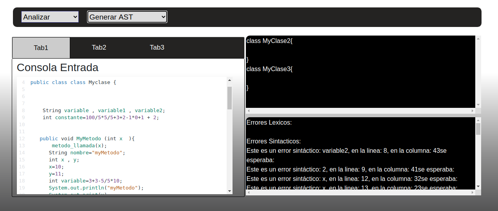
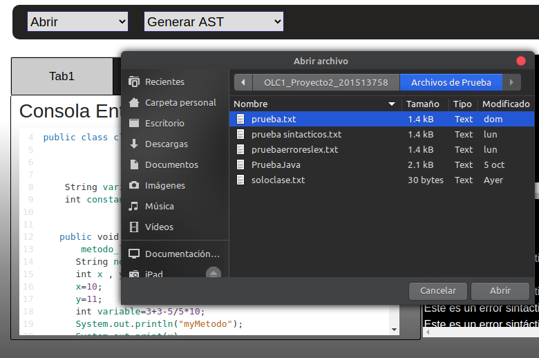
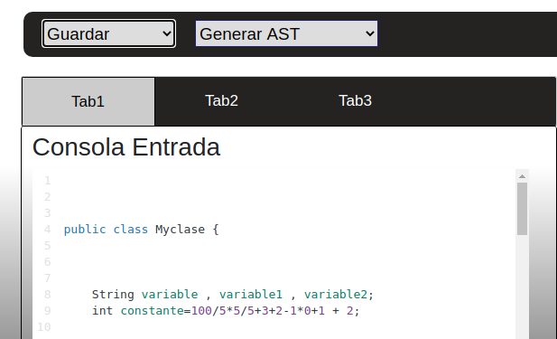
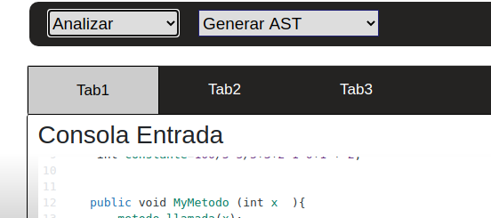
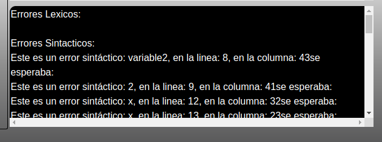
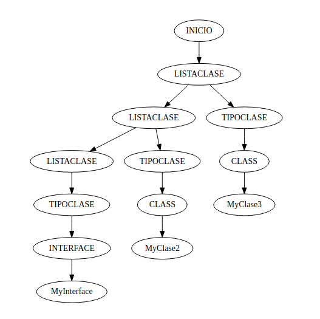

# Manual Usuario

# Descripcion:
- Aplicacion Web que realiza la traduccion de un lenguaje a otro utilizando herramientas para analisis léxico y sintactico, tecnologias Web Nodejs,desarrollado en lenguaje Go y JavaScript.

# Objetivos:

- Mostrar al usuario el uso y funcionamiento de la aplicacion Translator in Docker 
# Proyecto Translator in Docker

#Menu Principal
  
#Abrir 
Este menu permite cargar a la consola principal el archivo a Analizar 

#Guardar
Este menu permite guardar el archio en consola en un documento de texto

#Analizar
Este menu permite iniciar el analisis del codigo Java para su posterior traduccion 

#Consola de Salida JavaScript
La consola inferior derecha es donde se colocaran los disintos errores lexicos,sintacticos y lista de tokens Recuperados de l analisis 

#Menu Descargar 
El menu descargar permite descargar en un archivo Js el codigo Traducido 

#Reporte AST
El menu Reporte AST permite visualizar el diagrama realizado con Graphviz del Arbol AST del analizador 

